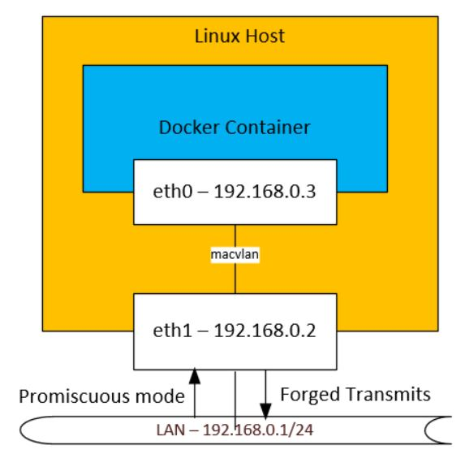

If you have a Docker container that requires Layer 2 connectivity towards a network e.g. for IP multicast in/out. Then macvlan is a good way to achieve this. This essentially allows the container to virtually sit on your LAN of choice. However you will find that some security changes are needed to make it work.


## Enabling VM Promiscuous Mode - LAN>Container
_This step is if your Linux host is in a VM_

It is of course quite common to run a Linux VM as your Docker host, however we need to make sure that the traffic from the LAN can flow towards your container by enabling promiscuous mode. This means your host Ethernet interface will still pick up packets not designated neccessarily for your host MAC. Then this gives the docker container a chance to pick the packets up. 

- On Oracle Virtualbox this is achieved by going to the Network Settings of the VM and This will mean that if you are running a hypervisor such as Virtualbox or VMware you will need to enable Promiscuous mode on the VM/vSwitch. There is no "Forged Transmits" protection mechanism on Virtualbox, so this can be ignored.
- In VMware ESXi this is achieved by going to the vSwitch security settings and enabling *Promisusous Mode* and *Forged Transits*. However this is not always desirable in production deployments.




## Container>LAN Traffic
Now we need to enable the traffic in the other direction. So that the packets from the container into the Linux Host is not dropped/blocked as per the diagram below.


We do this by enabling promiscuous mode on the interface that macvlan is using.

`sudo ip link set eth1 promisc on`

Now you should see that traffic flows outwards. You can ping your Docker container from another host in the network (but not the Linux host due to kernel security). This change is not persistent. One method to make it so is create a rc.local file to run some bash commands on startup.

1.	Create/edit the /etc/rc.local file: `sudo nano /etc/rc.local`

2.	Paste the following:

```
#!/bin/sh -e
ip link set eth1 promisc on
       exit 0
```

3.	Now make it executable with
`sudo chmod +x /etc/rc.local`

If you need to reach your Docker container from the Linux host, you can either use other non-macvlan networks to attach to the Docker container, however if you can only use macvlan, then you can follow this [guide](https://blog.oddbit.com/post/2018-03-12-using-docker-macvlan-networks/) to create a separate interface on your host, solely to reach the container.


## Pros
- The container "sits" on the network of your ethernet interface
- Multicast can traverse in/out

## Cons
- The downside is that your container will be sitting on the Layer 2 domain and requires you to have some firewalling in place on the Docker container, rather than depending on the host
- You cannot communicate between your container and the host machine due to the security restrictions in the Linux kernel. So pinging is not possible. You therefore need a separate interface to achieve communication
- Promiscuous mode requirement may be undesirable in production deployments

