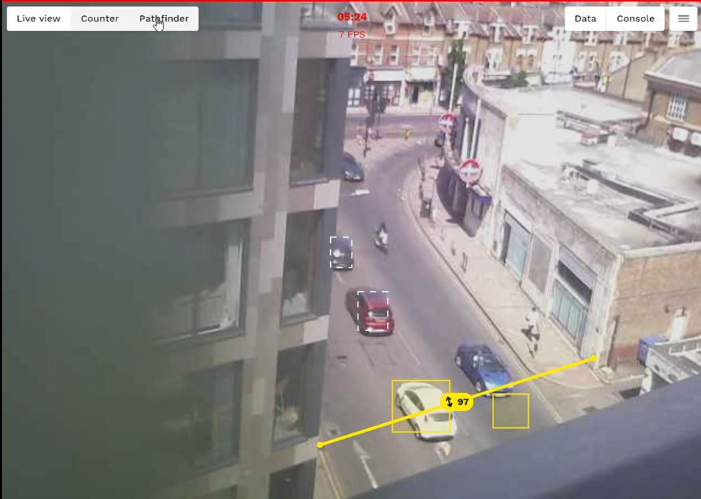

A quick Jetson Nano project I had in mind was use [OpenDataCam](https://github.com/opendatacam/opendatacam) to get YOLO to inference objects on the road and count the amount of pedestrians/cars/bikes/motorcycles outside.

I decided to [install the project from scratch](https://github.com/opendatacam/opendatacam/blob/master/documentation/USE_WITHOUT_DOCKER.md) rather than use the docker container, as I would be able to select different YOLO versions and rebuild. The best YOLO version I found was the pre-trained YOLOv3-tiny-prn. Sadly the Jetson Nano was struggling at 1 FPS with non-tiny v3 and v4.

Given the high angle and the low resolution of 400x400 snapshot that OpenDataCam extracts for inference, it had no problems with the cars (a previous attempt with mobilenet-ssd would pick them up as **suitcases!**) but struggled with motorcycles and pedestrians.

The next step is to cut down the specific part of the image I require, to hopefully increase the inference success rate.

And the answer is around 1000 cars per hour pass by on the main road.

Work in Progress...
