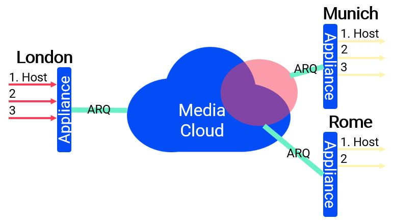
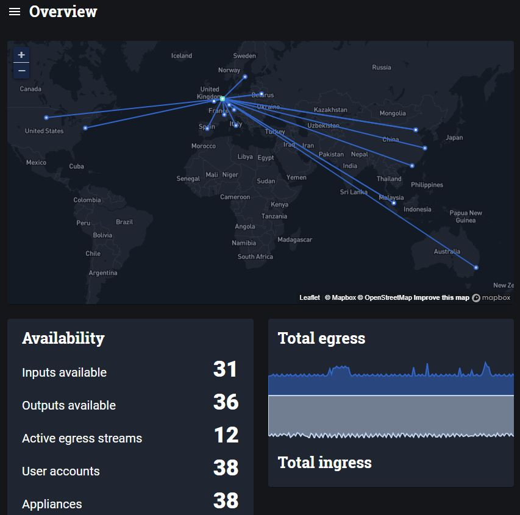

_May 2020_

The recent months with Covid-19 lockdown has seen a lot of presenters and journalists starting to broadcast from their homes. Sources now range from consumer digital video cameras to mobile phones, mixed with OBS Studio before being sent off via a Zixi/RIST/SRT/RTMP protocol to the broadcasters. Conventional broadcast over private managed networks and point-to-point ARQ Internet connections are gradually moving towards cloud topologies so that video feeds can reach the workflow in the cloud. With AWS Elemental and Grass Valley pushing their cloud based workflow systems, now more than ever is the need to get all your streams centralised in the cloud. Also it suits our "new normal" where people can work from home yet create broadcast quality productions. The ubiquity of the internet is seemingly taking over another industry! 

## Centralised Cloud Media Systems

These work like a virtual video router in the cloud, you bring in streams from anywhere on the internet and pass it on to whoever needs it, and maybe it stays within the cloud. There are many players in this space including AWS MediaConnect, Haivision Video Cloud, Net Insight Nimbra Edge and Zixi Zen master. The main transport principle is using an Automatic Retransmission reQuest (ARQ) Retransmission protocol so that you send things as fast as you can using UDP, but the receiver retains an ARQ Retransmission Buffer which is a window of opportunity to ask the sender for any missing packets before playing out. This is better for latency as it is fixed and can be optimised for the prevailing internet conditions. Conventional RTMP is TCP based requires an ACK for every packet which has its limitations for speed and consistency and is not the best for live video with a critical arrival requirement, but it is probably fine for your youtube stream which is delayed going to the consumer with an HTTP delivery protocol anyway.

## ARQ Protocols
Common ARQ Protocols are:
- Zixi
- SRT
- RIST 

Zixi has been long established in the broadcast media market and has been running a lot of TV you probably watch today. It is mature with a rich data set allowing for bonding and dynamic failovers. The other two are open source initiatives with RIST looking to mimic Zixi feature set with SMPTE2022-7 to allow 1+1 streams. A good strategy is to go for a media cloud solution that supports as many of these as possible, this way you can pick up and send to even more broadcasters/device types to consolidate everything. You can even use it as a protocol translator.

The rule to follow when setting your ARQ buffer is `ARQ Buffer = (4xRTT) + Jitter`

Within a continent we are generally able to see Internet Round Trip times of around 40-50ms (e.g Stockholm-London, Iowa-Montreal). So, an ARQ buffer of around 200ms is achievable for low-latency internet transport (but do not forget that codec latency is another factor to take into account). It is important to consider the worst congestion periods of the internet connections, e.g. In the early days of ARQ use, if you were on a remote Caribbean island you may see packet loss of 20% during peak evening times whereas most internet packet loss is <0.1%. For some feeds that are not critical for to have low latency, you may wish to set the ARQ buffer in range of seconds, to make sure the there is an undisturbed picture even during high packet loss periods.

## FEC
Another way to ensure your signal gets across is to send with Forward Error Correction (FEC) parity information. All 3 protocols have FEC as an option and it is up to the user to tune it to be best performance as there is latency in the recovery mechanism. One good example of how it can be used is to send two 1+1/bonding streams with 50% FEC overhead, resulting in a theoretical 200% at the receiver, maximising the chances of a good video signal and allowing for Seamless protection.

## Client Devices
These can be a physical appliance such as an Ateme Encoder, or a piece of software that is just a docker container that you can run on your Macbook. Most software is free so that you can easily get setup quickly. All should at a minimum allow UDP/RTP streams to be sent/received into the cloud. Good cloud systems should allow you to adjust the latency of each receiver so that you can have a customised ARQ buffer for each receiver or allow alignment of a group of receivers.

## Codec Latency
Latencies vary greatly between 150ms to seconds with MPEG4 & HEVC (highly dependent on implementation), to the lower latency encoders such as JPEG2000 (~80-100ms) and the Ultra Low Latency (ULL) JPEG-XS (~2ms). You have to balance out the need for speed versus the bandwidth available and quality of the link.

## Synchronisation
Since media clouds can be used for distribution purposes (e.g. to supplement or replace Satellite), synchronisation can be very important if you want to have the same experience for all the receivers. You may wish to make the ARQ for everyone the same by aligning to the worst connection in Polynesia or stagger different groups. Synchronisation can be achieved by using NTP or even encoding time into the signal. NTP would require everyone to be synchronised to absolute time to ensure perfect performance.

## Management

_Nimbra Edge instance shown here is run in Microsoft Azure in the Netherlands and has clients devices all over the world - a 2 second ARQ is fine for the connection from Stockholm to my colleague in Melbourne_

Ease of use is paramount to anything boasting to be a cloud technology. It cannot be simply the same user interface that was created for one device being plonked into the cloud. If the system is made well, then usage would increase on the system driving more traffic. The ability for individual broadcasters to publish content and share with whomever they want is a powerful tool. Different levels of access is important too, the engineering team may need to know about multicast addressing, however some users may need to be limited to a simple drag & drop interface.

## Scaling

It is important to choose a system that will allow you to increase as your capacity does. For some services it will be a Seamless service that you do not need to know about, for others you may require some pre-made scaling Kubernetes rules. And if you are running the system yourself, you will always need to rely on your defined internet pipe.

## Multiregion

You may wish to have some servers populated in strategic locations, some cloud services might allow you to run a local server cluster in US Central, with only one copy of the video from Europe, before it distributes locally to the 100 US recievers. This allows you to have a reduced ARQ buffer size as the traffic does not need to traverse transatlantic links.

## Costs: Public vs Private Cloud

The billing of all these systems vary greatly, most systems have an aspect of charging per GB egressing from the system. Some are time based. The important thing is to choose one that suits your use-case. Public cloud is by far the fastest way to get started (we get new deployments installed in 10 minutes in AWS/Azure), however that flexibility comes at a cost. If you are running 24/7 high quality streams, you may well need to look at running your own datacentre, bare-metal and internet pipes. Only some of the software solutions allow bare-metal installations as well as public cloud. And even fewer that support Hybrid solutions.

## Internet vs Private Line Connectivity

There is always a way to solve connectivity, insted of depending on your 10Gbps Internet pipe, you may wish to use a DirectConnect to get to AWS MediaConnect or run your own bare-metal installation over private leased lines which should offer you commited SLAs and better performance. Heck why not combine the two and run one leg of a 1+1 over Private and the other on Public Internet. We are pretty much at the stage where we can rely on the software to give us better resiliency.

## Statistics

To prove SLAs to end consumers over internet connectivity is not easy, was it the problem in the first mile, or somewhere else in the internet. That will always be hard to find out. However statistics will help you gain a better picture of the wild-west that is the Internet.

## Outro
So there are no shortage of cloud platforms to look at. Maybe you are already into one system and are happily using it. The market being so competitive at the moment it probably comes down to ease of use (for the end-user or the engineering team?) and the cost. Given that everything is cloud based and is avaiable as a SaaS - you can probably change between them quite easily!

