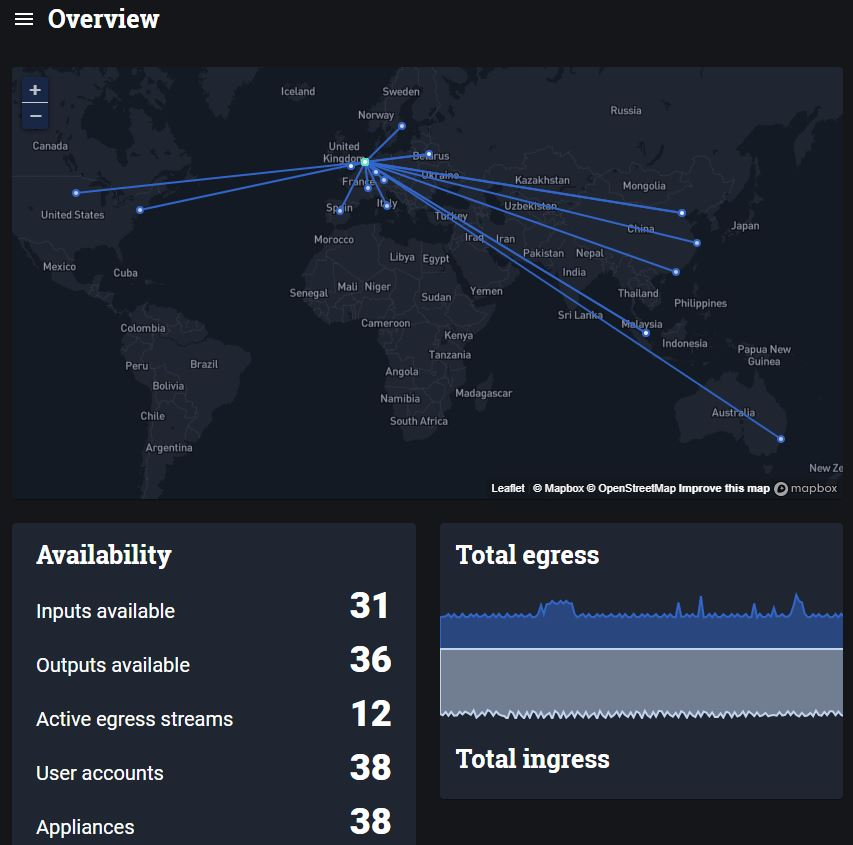

_May 2020_

The recent months with Covid-19 lockdown has seen a lot of presenters and journalists starting to broadcast from their homes. Sources now range from consumer digital video cameras to mobile phones, mixed with OBS Studio before being sent off via a Zixi/RIST/SRT/RTMP protocol to the broadcasters. Conventional broadacast over private managed networks and point-to-point ARQ Internet connections towards cloud topologies so that video feeds can reach the workflow in the cloud. With AWS Elemental and Grass Valley pushing their cloud based workflow systems, now more than ever is the need to get all your streams centralised in the cloud. Also it suits our new normal working where people can work from home yet create broadcast quality productions.

## Centralised Cloud Media Systems

_Nimbra Edge shown here is run in Microsoft Azure in Netherlands and has clients devices all over the world - a 2 second ARQ is fine for the connection from Stockholm to my colleague in Melborne_

These work like a virtual video router in the cloud, you bring in streams from anywhere on the internet and pass it on to whoever needs it, and maybe it stays within the cloud. There are many players in this space including AWS MediaConnect, Haivision Video Cloud, Netinsight Nimbra Edge and Zixi Zen master. The main transport principle is using an Automatic Retransmission reQuest (ARQ) Retransmission protocol so that you send things as fast as you can using UDP, but the receiver retains an *ARQ Retransmission Buffer* which is a window of opportunity to ask the sender for any missing packets before playing out. This is better for delay as it is fixed and can be optimised for the previaling internet conditions. Conventional RTMP  is TCP based requires an ACK for every packet which has its limitations for speed and consistency and is not the best for live video with a critical arrival requirement, but is fine for your youtube or Twitch stream which is delayed going to the consumer with an HTTP delivery protocol anyway.

## ARQ Protocols
Common Protocols are:
- Zixi
- SRT
- RIST 
Zixi has been long established in the broadcast media market and has been running a lot of TV you probably watch today. It is mature with a rich data set allowing for bonding and dynamic failovers. The other two are open source intiatives with RIST looking to mimic Zixi feature set with SMPTE2022-7 to allow 1+1 streams.

The rule to follow with setting your ARQ buffer is ` ARQ Buffer = (4xRTT) + Jitter`

Within a continent we are generally able to see internet Round Trip times of around 40-50ms (Stockholm-London, Iowa-Montreal). So an ARQ buffer of around 200ms is achievable for low-latency internet transport. However codec latency is another factor to take into account. It is important to take into account the worst congestion periods of the internet connections, e.g. In the early days of ARQ use, if you were on a remote carribean island you may see packet loss of 20% during peak evening times whereas most internet packet loss is <0.1%. For some feeds that are not critical for to have low latency, you may wish to set the ARQ buffer in range of seconds, to make sure the there is an undisturbed picture even during high packet loss periods.

## FEC
ANother way to ensure your signal gets across is to send with Forward Error Correction (FEC). All 3 protocols have FEC as an option and it is up to the user to tune it to be best performance as there is latency in the recovery mechanism. One good example of how it can be used is to send two 1+1/bonding streams with 50% FEC overhead, resulting in a theoretical 200% at the receiver, maximising the chances of a good video signal and allowing for Seamless protection.

## Codec Latency
Latencies vary greatly between 150ms to seconds with MPEG4 & HEVC (highly dependent on implementation), to the lower latency encoders such as JPEG2000 (~80-100ms) and the Ultra Low Latency (ULL) JPEG-XS (~2ms). You have to balance out the need for speed versus the bandwith available and quality of the link.

